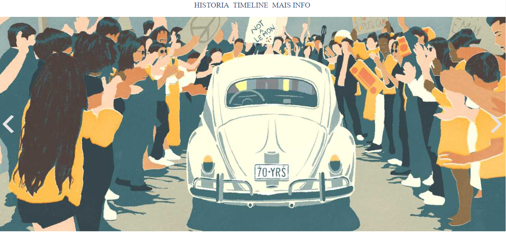
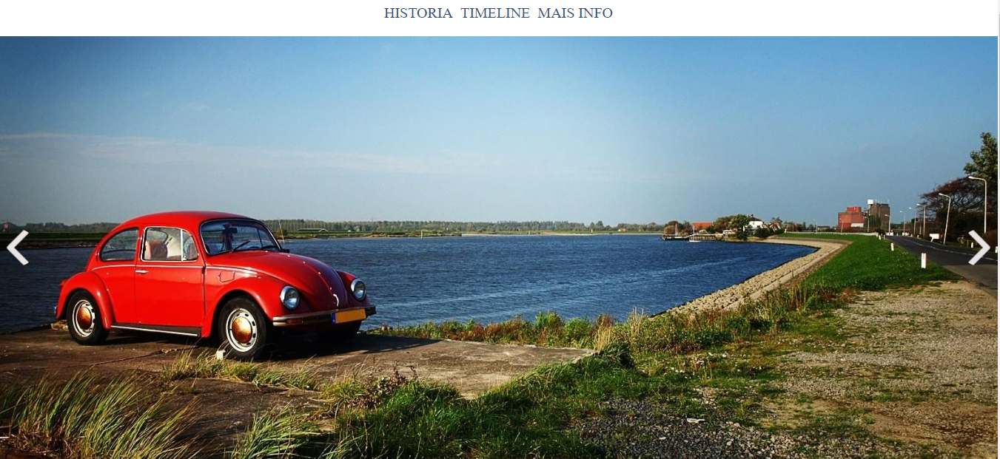
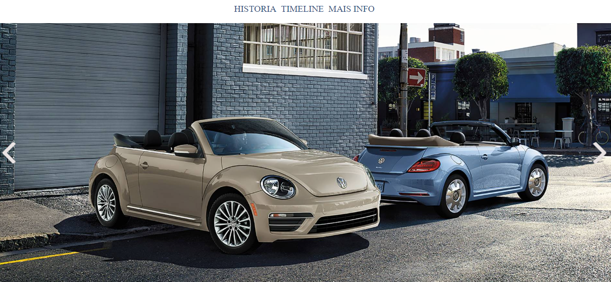
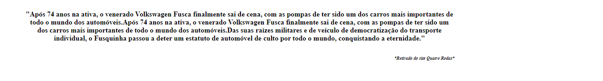
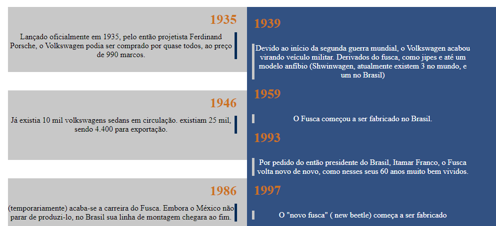
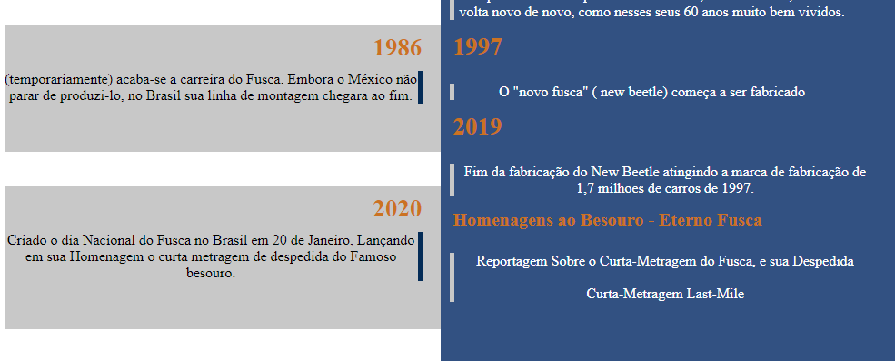

<h1><b> Projeto SliderShow com JS 😎👍</b></h1> 

Projeto desenvolvido em live da Plataforma B7Web, utilizando JavaScript, CSS e HTML❗
 

 Algumas Costumizações feitas por mim mesmo @SuzanaSuzuki🎯

<h2>Projeto a ser concluído</h2> 

 
 
 
 
 
 
 